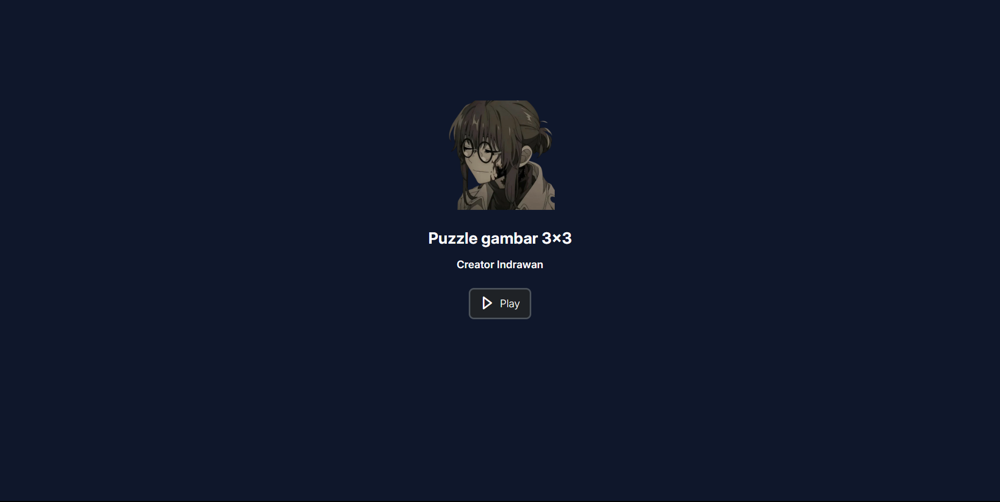

<p align="center">
  <a href="" rel="noopener">
 </a>
</p>

<h3 align="center">anime-puzzle</h3>

<div align="center">

[]()
[](https://github.com/kylelobo/The-Documentation-Compendium/issues)
[](https://github.com/kylelobo/The-Documentation-Compendium/pulls)
[](/LICENSE)

</div>

---

<p align="center"> project for fun hahaah.
    <br> 
</p>

## 📝 Table of Contents

- [📝 Table of Contents](#-table-of-contents)
- [🧐 About ](#-about-)
- [🏁 Getting Started ](#-getting-started-)
  - [Prerequisite](#prerequisite)
  - [Installing](#installing)
- [⛏️ Built Using ](#️-built-using-)

## 🧐 About <a name = "about"></a>

project ini di buat untuk memperkuat saya dalam mempelajari reactjs

## 🏁 Getting Started <a name = "getting_started"></a>


### Prerequisite

```

  vite@latest

```
  pick React for freamwork, and ordinary javaScript for the languange
 
### Installing


```

npm install

```

```

npm run dev

```

```

localhost:5137


```


project ready run on your computer


## ⛏️ Built Using <a name = "built_using"></a>


- [ReactJs](https://react.dev/) - Web Framework
- [Vite](https://vite.dev/) - fast build and free memory


