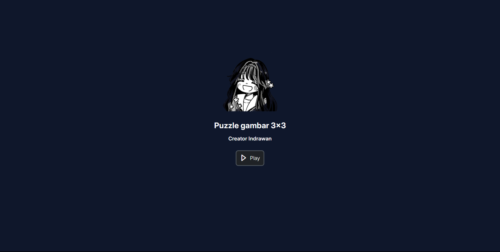

<p align="center">
  <a href="" rel="noopener">
 </a>
</p>

<h3 align="center">anime-puzzle</h3>

<div align="center">

[]()
[](https://github.com/kylelobo/The-Documentation-Compendium/issues)
[](https://github.com/kylelobo/The-Documentation-Compendium/pulls)
[](/LICENSE)

</div>

---

<p align="center"> Few lines describing your project.
    <br> 
</p>

## 📝 Table of Contents

- [📝 Table of Contents](#-table-of-contents)
- [🧐 About ](#-about-)
- [🏁 Getting Started ](#-getting-started-)
  - [Prerequisites](#prerequisites)
  - [Installing](#installing)
- [⛏️ Built Using ](#️-built-using-)
- [✍️ Authors ](#️-authors-)
- [🎉 Acknowledgements ](#-acknowledgements-)

## 🧐 About <a name = "about"></a>

susun kembali puzzle yang teracak dengan mengklik salah satu bagiannya

## 🏁 Getting Started <a name = "getting_started"></a>

These instructions will get you a copy of the project up and running on your local machine for development and testing purposes. See [deployment](#deployment) for notes on how to deploy the project on a live system.

### Prerequisites

What things you need to install the software and how to install them.

```
  - vite@latest : pick React for freamwork, and ordinary javaScript for the languange

```
 
### Installing

A step by step series of examples that tell you how to get a development env running.

run npm run dev in your terminal

```
npm run dev
```

go to localhost:5137

```
project ready run on your computer
```


``
## ⛏️ Built Using <a name = "built_using"></a>


- [ReactJs](https://react.dev/) - Web Framework
- [Vite](https://vite.dev/) - fast build adn free memory

## ✍️ Authors <a name = "authors"></a>

- [@kylelobo](https://github.com/kylelobo) - Idea & Initial work

See also the list of [contributors](https://github.com/kylelobo/The-Documentation-Compendium/contributors) who participated in this project.

## 🎉 Acknowledgements <a name = "acknowledgement"></a>

